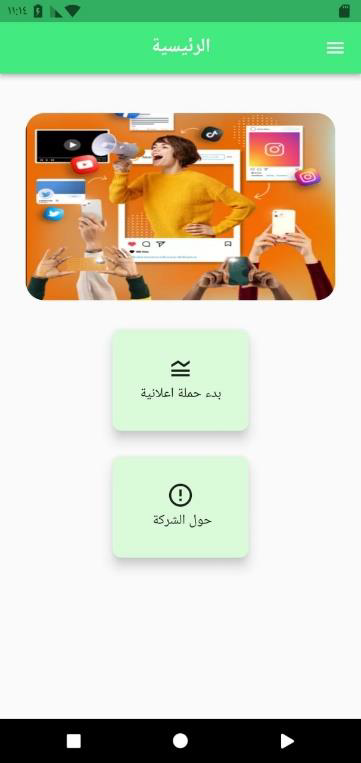
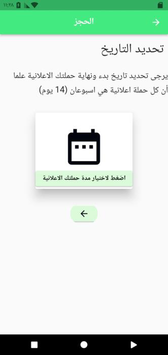
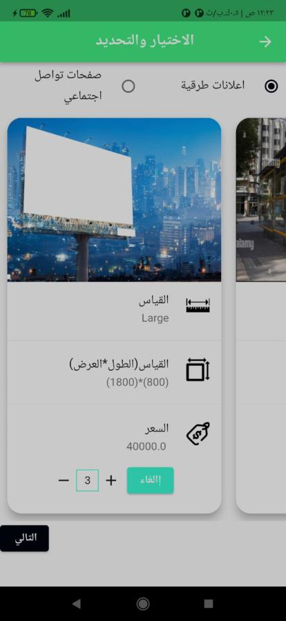

<h3 align="center">Advertisement Services App</h3>

## About The Project

Designed an advertising app merging billboard and social media strategies, empowering users to tailor ad campaigns with precise location and design choices. Our platform seamlessly connects users with influential social media figures, ensuring efficient product promotion and maximizing reach. Whether you're crafting a billboard campaign or leveraging social media influencers, our user-friendly interface simplifies the entire process. along with design options, for personalized advertising campaigns.

## Screenshots

 

 

 

## Find this repository useful? :heart:
Support it by a star for this repository. :star:  
Also, __[follow me](https://github.com/mohamedshasho/)__ on GitHub, __[follow me](https://www.linkedin.com/in/mohammad-shasho/)__ on LinkedIn ! 🤩

License
=======
    Copyright (c) 2022 Mohammad Shasho

    Permission is hereby NOT granted to any person or entity obtaining a copy of this software and associated documentation files (the "Software") to use, copy, modify, merge, publish, distribute, sublicense,        and/or sell copies of the Software without explicit written permission from the author.

    The use of this Software is restricted to [Specify the specific use or purpose, e.g., "internal use within my company" or "for educational purposes only"].

    For licensing inquiries and permissions, please contact the author at mohamedshasho1@gmail.com.

    THE SOFTWARE IS PROVIDED "AS IS," WITHOUT WARRANTY OF ANY KIND, EXPRESS OR IMPLIED, INCLUDING BUT NOT LIMITED TO THE WARRANTIES OF MERCHANTABILITY, FITNESS FOR A PARTICULAR PURPOSE, AND NONINFRINGEMENT. IN       NO EVENT SHALL THE AUTHORS OR COPYRIGHT HOLDERS BE LIABLE FOR ANY CLAIM, DAMAGES, OR OTHER LIABILITY, WHETHER IN AN ACTION OF CONTRACT, TORT, OR OTHERWISE, ARISING FROM, OUT OF, OR IN CONNECTION WITH THE         SOFTWARE OR THE USE OR OTHER DEALINGS IN THE SOFTWARE.
